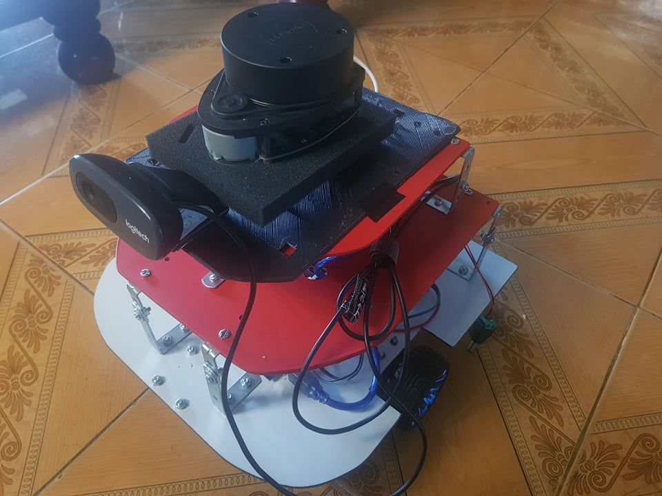
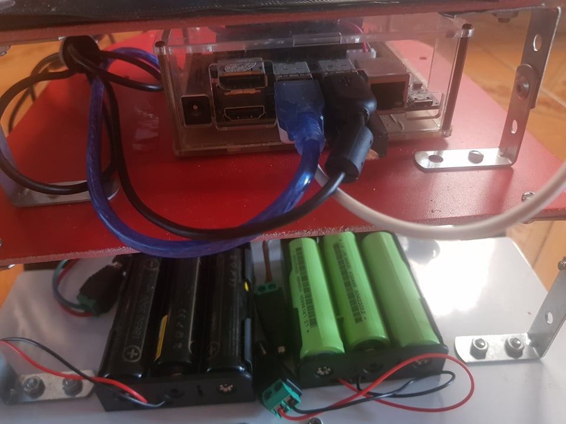
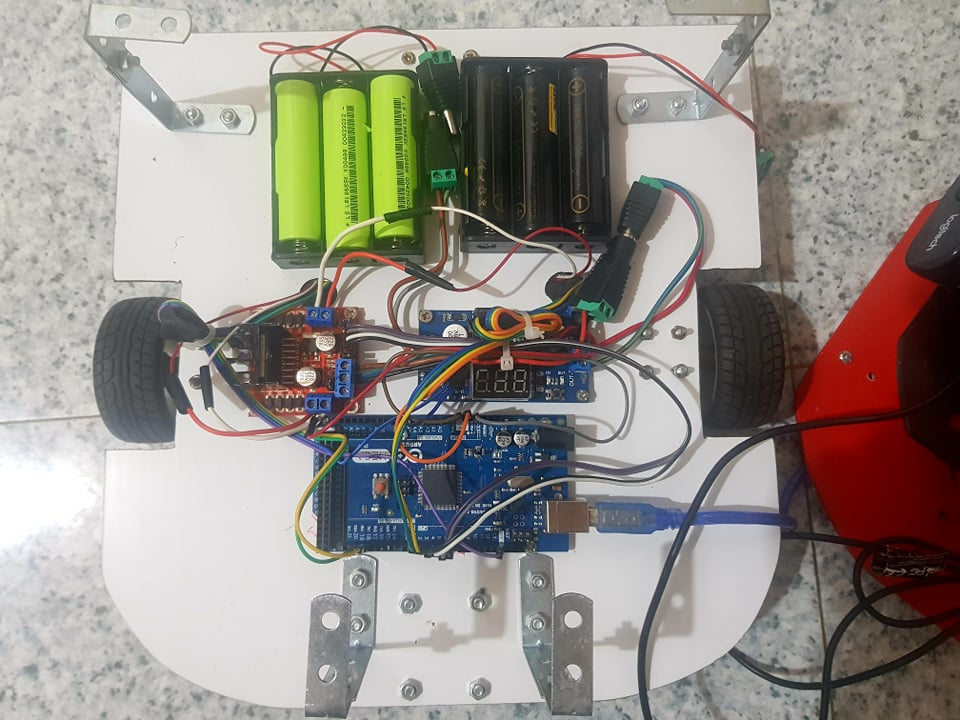

# robot-navigation

## Introduction
This project is... .A self-navigating robot for .... We build a robot in ROS and integrate several functions: self-navigation, face detection and tracking
## Recent updates

## Overview of the project
<div align="center">
    
    
    
</div>

## Project flow (Demo)
### 1.Navigation
### 2.Face detection and tracking

### 3.Logic flow

## To Do 
- [ ] IMU MPU6050.
- [ ] Auto charging.
- [ ] Display for student.
- [ ] More features in need.

## Tutorials
- Requirement
    - [Hardware](./docs/hardware.md)
    - [Software](./docs/software.md)
- Installation
    - [Setup jenson nano image](./docs/Jetson_nano_image.md)
    - [Setup USB wifi](./docs/rtl8812au.md)
    - [Setup Nox_ws](./docs/nox_ws.md)
    - [Setup Camera_ws](./docs/camera_ws.md)
## Build Nox 
```bash
mkdir -p catkin_ws/src
cd catkin_ws/
catkin_make
source devel/setup.bash
```
## Test Navigation
```bash
ls -l /dev |grep ttyUSB
sudo chmod 666 /dev/ttyUSB0
sudo chmod 666 /dev/ttyACM0

roslaunch nox nox_bringup.launch
roslaunch nox nox_slam.launch
rosrun teleop_twist_keyboard teleop_twist_keyboard.py
```
## References
- [Nox robot](https://github.com/RBinsonB/Nox_robot)
